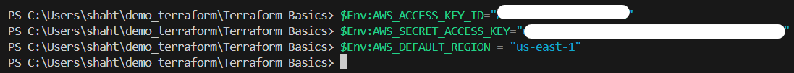
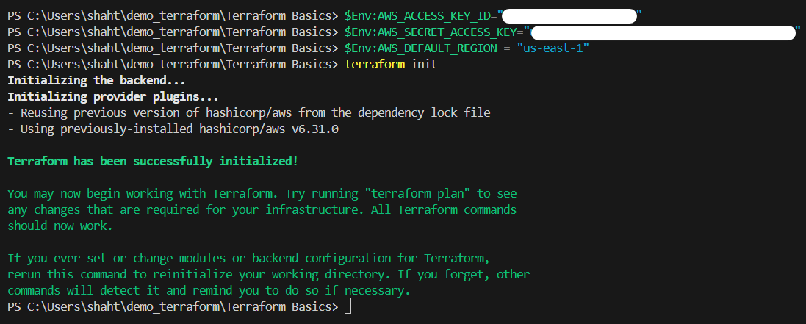

# Day 1: Environment Setup ✅

**Feb 3, 2026 - Windows 10 Home**

#1.1
## Completed Setup
- **GitHub** repo created (`shahtaj2102/terraform-aws-vpc`)
- **VS Code** downloaded & installed
- **Terraform v1.14.4** (Windows AMD64) → PATH configured
- **AWS CLI** installed (`winget`)

#1.2
1. Setup user in AWS to have credentials.
2. Set those credentials in PowerShell as variables using **$Env**

#1.3
we can confirm that are variables are set and also initiate terraform using terraform init

**My day 1 learnings complete.**
