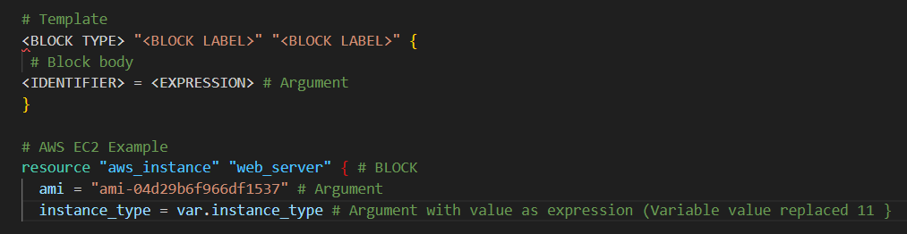

# Terraform Day 2 Notes

## 2.1 What is HCL?
HCL (HashiCorp Configuration Language) is Terraform's simple language for writing infrastructure code in .tf files.
​

Uses blocks and key-value pairs that are easy for humans to read and write.

**Template**

This is a small example for an **EC2 instance**

## 2.2 Benefits of HCL

Readable: Looks like simple config files, not complex code

Multi cloud: Works with multiple cloud types, Even in the same file

Terraform native: Built specifically for infrastructure as code

JSON compatible: Machines can generate/parse it easily

## 2.3 Core Commands

`terraform init`: Initializes a Terraform working directory by downloading providers, modules, and setting up the backend.

​
`terraform validate`: Validates the configuration files for syntax errors and basic configuration issues before planning.

​
`terraform plan`: Generates an execution plan previewing changes Terraform will make without applying them, showing adds (+), changes (~), or destroys (-).

`terraform apply`: Applies the changes from the plan to create, update, or destroy resources; use -auto-approve in automation to skip confirmation.

`terraform destroy`: Destroys all tracked infrastructure and removes everything from state.
​

## 2.4 Terraform State File
The Terraform state file (`terraform.tfstate`) is a JSON file that acts as the single source of truth, mapping your configuration to real-world infrastructure resources Terraform manages.

It stores resource addresses, attributes, dependencies, metadata, and outputs, enabling Terraform to detect drift, plan changes, and maintain performance without repeated API calls.

## 2.5 State relate commands

`terraform state list`      # List resources in state

`terraform state show`      # Show resource details

`terraform state mv`        # Move/rename resource

`terraform state rm`        # Remove from state

## 2.6 Some other commands

`terraform fmt`      # Formats all .tf files to standard style

`terraform -version` # Shows Terraform version

`terraform -help`    # Shows help for all commands

